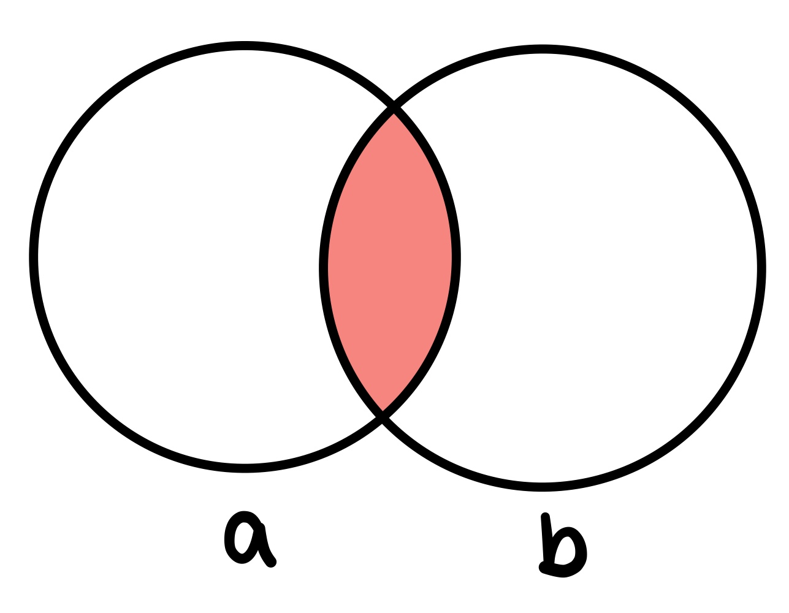
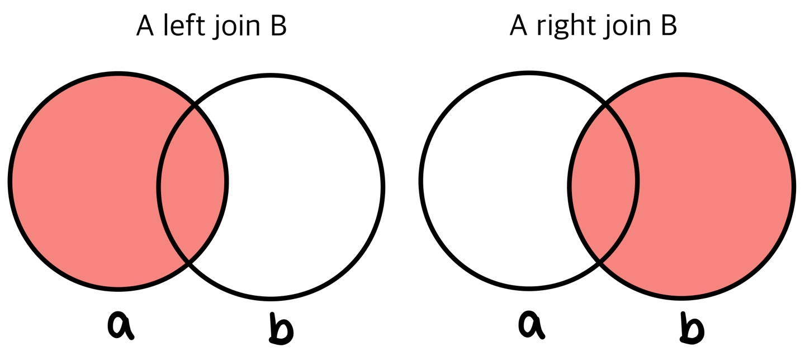
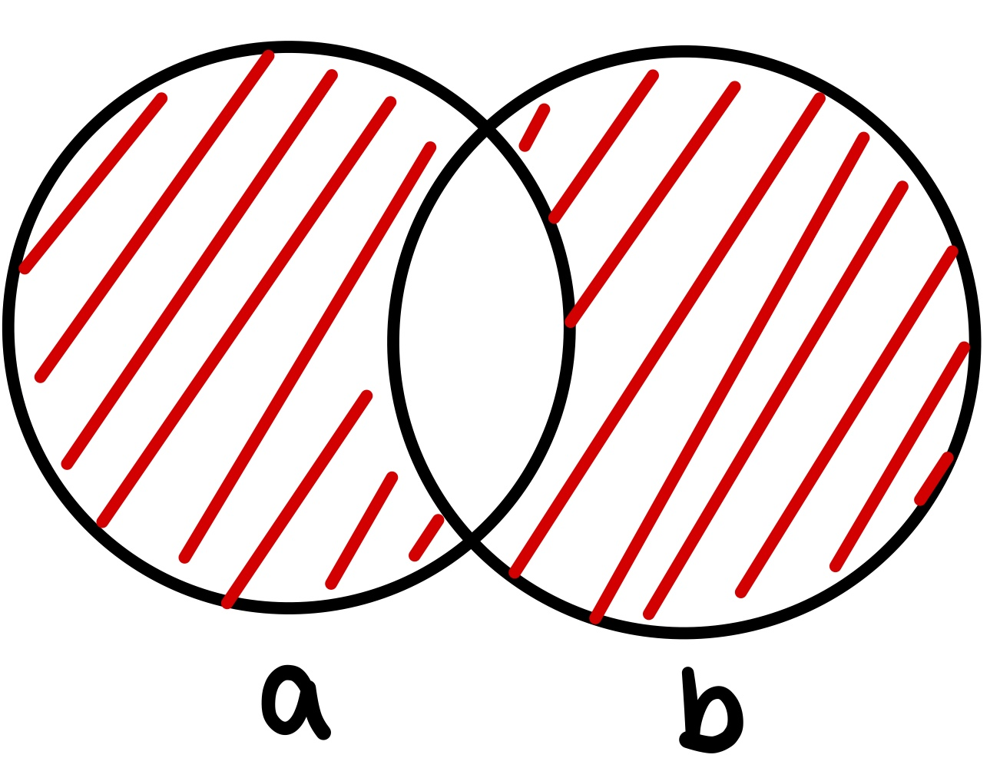

# Join

## Inner Join

```sql
SELECT a.id, a.name, b.title,
FROM aaaa a
JOIN bbbb b
ON a.id = b.song_id; */조건/*
```

- ON 대신 WHERE 사용가능

- 두 테이블 모두 포함하는 레코드를 합쳐서 표현
- 


## LEFT OUTER, RIGHT OUTER JOIN

```mysql
SELECT a.id, a.name, b.title,
FROM aaaa a
LEFT JOIN bbbb b
ON a.id = b.song_id; */조건/*
```

- 일치하지 않는 값을 가지고 있더라도 표시(NULL 값으로 표시됨)
- 위 예시일 경우, aaaa 테이블을 기준으로 bbbb에 해당 데이터가 없을 경우 NULL로 표시
- 만일 bbbb 기준으로 하고 싶다면, FROM aaaa a RIGHT JOIN bbbb b 으로 작성
- 


## OUTER JOIN

- MySQL에서는 OUTER JOIN을 지원하지 않지만, 유사하게 처리 가능

```mysql
SELECT a.id, a.name, b.title,
FROM aaaa a
JOIN bbbb b
ON a.id <> b.song_id; */조건/*
```

- 두 테이블 중 한 곳에만 포함되는 경우
- 

## CROSS JOIN( 카티전 조인 )

```mysql
SELECT a.id, a.name, b.title,
FROM aaaa a, bbbb b;

SELECT a.id, a.name, b.title,
FROM aaaa a
CROSS JOIN bbbb b;
```

- 집합의 곱의 개념,
- A= {a, b, c, d} , B = {1, 2, 3} 일 때, (a,1), (a, 2), (a,3), (b,1), (b,2), (b,3), (c, 1), (c,2), (c,3), (d, 1), (d, 2), (d,3)
- 계수는 n(A) * n(B) = 4 * 3 = 12


참고:

[https://futurists.tistory.com/17](https://futurists.tistory.com/17)

