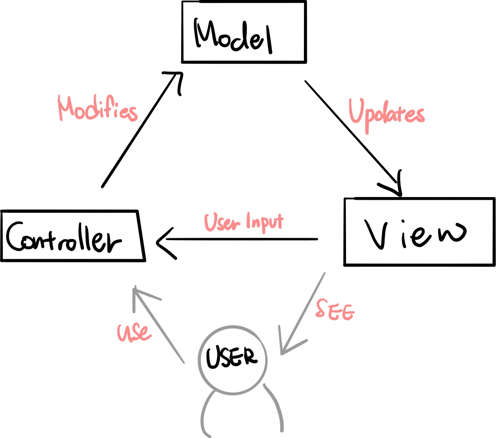

# MVC vs MVP vs MVVM

## MVC Pattern

: Model - View - Controller, 3가지로 역할을 나누어 개발하는 패턴

### 구조

#### Model, 모델

: 어플리케이션에서 사용되는 데이터와 그 데이터를 처리하는 부분

- 뷰나 컨트롤러의 정보 없이 사용할 수 있도록 하여 재사용이 가능하게 하고, 다른 인터페이스에서 변하지 않도록 한다.

#### View, 뷰

: input 텍스트, 체크박스 등과 같은 사용자 인터페이스 요소, 사용자에게 보여지는 UI 부분

#### Controller, 컨트롤러

: 사용자의 입력으로 받은 이벤트를 처리하는 역할

### 동작순서

1. 사용자의 Action이 Controller에 들어온다.

2. Controller는 사용자의 Action에 따라 Model을 업데이트 한다.

3. Controller는 Model을 나타내줄 View를 선택한다.

4. View는 Model을 이용하여 화면을 나타낸다.

   - View가 Model을 이용하여 직접 업데이트 하는 방법

   - Model에서 View에게 Notify하는 방법

   - View가 Polling으로 주기적으로 Model의 변경을 감지하여 업데이트 하는 방법

     

### 특징

- Controller는 여러개의 View를 선택할 수 있는 1:n 구조
- Controller는 View를 선택할 뿐 직접 업데이트 하지 않는다.
- 장점: 단순하다, 보편적으로 많이 사용되는 디자인 패턴
- 단점: View와 Model 사이의 의존성이 높다.-> 유지보수가 어렵다.

## MVP Pattern 

: Model - View - Presenter로 구성, Controller대신 Presenter가 존재

### 구조

#### Presenter

: View에서 요청한 정보로 Model을 가공하여 View에 전달해 주는 부분

### 동작 순서

1. View를 통해 Action이 들어온다

2. 각각의 부분에서 데이터 요청과 응답을 주고 받는다.

   View --(요청)--> Presenter --(요청)--> Model --(응답)--> Presenter --(응답)--> View

참고 :

[https://beomy.tistory.com/43](https://beomy.tistory.com/43)

