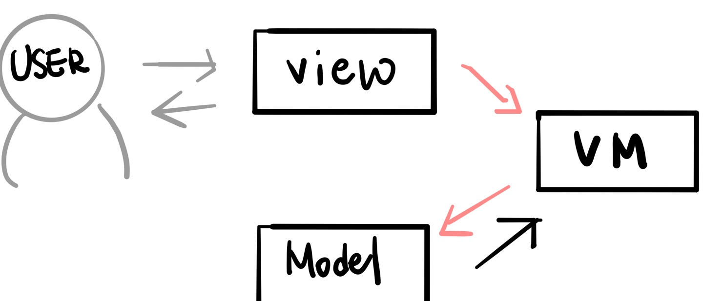

# MVC vs MVP vs MVVM

## MVC Pattern

: Model - View - Controller로 구성, 3가지로 역할을 나누어 개발하는 패턴

### 구조

#### Model, 모델

: 어플리케이션에서 사용되는 데이터와 그 데이터를 처리하는 부분

- 뷰나 컨트롤러의 정보 없이 사용할 수 있도록 하여 재사용이 가능하게 하고, 다른 인터페이스에서 변하지 않도록 한다.

#### View, 뷰

: input 텍스트, 체크박스 등과 같은 사용자 인터페이스 요소, 사용자에게 보여지는 UI 부분

#### Controller, 컨트롤러

: 사용자의 입력으로 받은 이벤트를 처리하는 역할

### 동작순서

1. 사용자의 Action이 Controller에 들어온다.

2. Controller는 사용자의 Action에 따라 Model을 업데이트 한다.

3. Controller는 Model을 나타내줄 View를 선택한다.

4. View는 Model을 이용하여 화면을 나타낸다.

   - View가 Model을 이용하여 직접 업데이트 하는 방법

   - Model에서 View에게 Notify하는 방법

   - View가 Polling으로 주기적으로 Model의 변경을 감지하여 업데이트 하는 방법

     

### 특징

- Controller는 여러개의 View를 선택할 수 있는 1:n 구조
- Controller는 View를 선택할 뿐 직접 업데이트 하지 않는다.
- 장점: 단순하다, 보편적으로 많이 사용되는 디자인 패턴
- 단점: View와 Model 사이의 의존성이 높다.-> 유지보수가 어렵다.

예제 참고 : [https://hanee24.github.io/2018/02/14/what-is-mvc-pattern/](https://hanee24.github.io/2018/02/14/what-is-mvc-pattern/)

 

## MVP Pattern 

: Model - View - Presenter로 구성, Controller대신 Presenter가 존재

### 구조

#### Presenter

: View에서 요청한 정보로 Model을 가공하여 View에 전달해 주는 부분

### 동작 순서

1. View를 통해 Action이 들어온다

2. 각각의 부분에서 데이터 요청과 응답을 주고 받는다.

   View --(데이터 요청)--> Presenter --(데이터 요청)--> Model --(응답)--> Presenter --(응답)--> View

3. View는 Presenter가 응답한 데이터를 이용하여 화면을 나타낸다.

### 특징

- Presenter는 View와 Model의 인스턴스를 가지고 있어 둘을 연결하는 접착제 역할을 한다.
- Presenter와 View는 1:1관계
- 장점 : Presenter를 통해서만 데이터를 전달 받기 때문에 View와 Model의 의존성이 없다(->MVC패턴의 단점).
- 단점 : View와 Presenter사이의 의존성이 높다. 어플리케이션의 복합도:point_up: -> 둘 사이의 의존성:point_up:

예제 참고 : [https://faith-developer.tistory.com/71](https://faith-developer.tistory.com/71)

 

## MVVM

: Model - View - View Model로 구성

### 구조

#### View Model

: View를 표현하기 위해 만든 View를 위한 Model

### 동작

1. 사용자의 Action이 View를 통해 들어온다.
2. Command 패턴으로 View Model에 Action을 전달한다.
3. View Model은 Model에게 데이터를 요청한다.
4. Model은 VM에게 데이터를 응답한다.
5. VM은 응답 받은 데이터를 가공하여 저장한다.
6. View는 VM과 Data Binding하여 화면을 나타낸다.

### 특징

- MVVM은 Command 패턴과 Data Binding(데이터 결합)을 사용하여 구현되었으며, 이를 통해 View와 VM 사이의 의존성을 없앴다.
- VM과 View는 1:n관계
- 장점: View와 Model사이, View와 VM사이의 의존성이 없다,== 각 부분이 독립적이기 때문에 모듈화하여 개발할 수 있다.
- 단점: View Model의 설계가 쉽지 않다.

#### Commad Pattern

: 요청을 객체의 형태로 캡슐화하여 사용자가 보낸 요청을 나중에 이용할 수 있도록 매서드 이름, 매개변수 등 요청에 필요한 정보를 저장 또는 로깅, 취소할 수 있게 하는 패턴

#### Data Binding

: provider와 consumer의 데이터를 연결하고 동기화 시키는 라이브러리

-> 사용자가 입력한 값을 어플리케이션 도메인 객체에 동적으로 할당하는 기능

참고 :

[https://beomy.tistory.com/43](https://beomy.tistory.com/43)

[위키백과: 커맨드 패턴](https://ko.wikipedia.org/wiki/%EC%BB%A4%EB%A7%A8%EB%93%9C_%ED%8C%A8%ED%84%B4)

