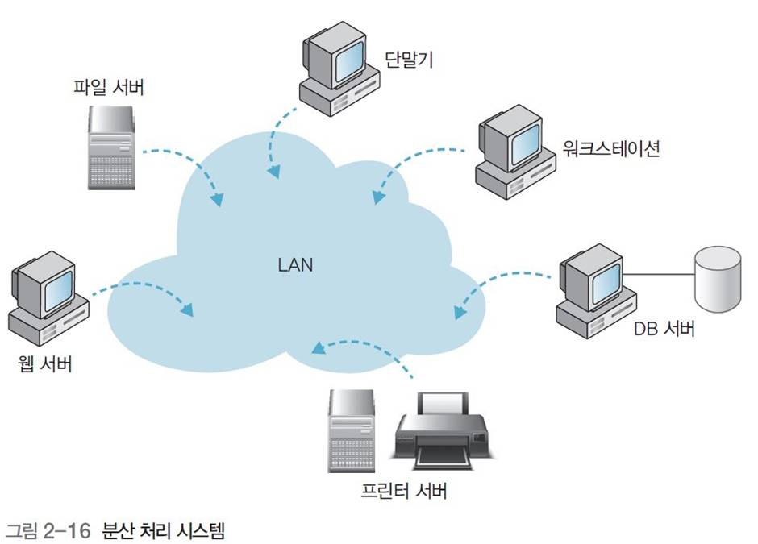

# OS유형

## 1. 운영체제의 발전 과정

| 연도          | 운영체제                                                     | 특징                                                         |
| ------------- | ------------------------------------------------------------ | ------------------------------------------------------------ |
| 1940~         | 운영체제 없음(작업별 순차 처리)                              | - 기계어를 직접 사용 - 단순 순차(직렬) 처리             |
| 1950~         | 일괄 처리 시스템                                             | - 작업별로 일괄 처리 - 버퍼링, 스풀링 방법 등장         |
| 1960~         | - 다중 프로그래밍 시스템 - 시분할 시스템 - 다중 처리 시스템 - 실시간 처리 시스템 | - 가상 기억장치 등장 - 다중 프로그래밍, 다중 처리, 시분할 처리 등 개념 등장 - 운영체제를 고급 언어로 작성 - 데이터 통신 지원용 운영체제 사용 |
| 1970년대 초반 | - 다중 모드 시스템 - 범용 시스템                        | - 일괄 처리, 시분할 처리, 실시간 처리, 다중 프로그래밍 등을 제공하는 다중 모드 시스템 등장 - 장치의 독립성 제공 - TCP 통신 표준 활성화 - 운영체제가 네트워크와 보안을 아우르는 수준으로 발전 |
| 1970년대 중반 | 분산 처리 시스템                                             | - 각종 응용 프로그램 개발 및 데이터베이스 활용 확대  - 네트워크 기술의 발전 - 하드웨어에 운영체제 개념이 포함된 펌웨어 개념 등장 |

 

 

## 2. 운영체제 유형

### 1) 일괄 처리 시스템(batch processing system)

- 직렬 처리 기술과 동일
- 작업 준비 시간을 줄이기 위해 데이터가 발생할 때마다 즉시 처리하지 않고 데이터를 일정 기간 또는 일정량이 될 때까지 모아 두었다가 한꺼번에 처리
- 버퍼링, 스풀링 등 방법 도입
- 단점
  - 준비 작업들의 유형이 동일해야 하고, 작업에 모든 유형의 입력 불가능
  - 입출력장치가 프로세서보다 속도 느려 프로세서의 유휴 상태 발생

#### 버퍼링과 스풀링(Spooling, Simultaneous Peripheral Operation On-Line)

: CPU의 처리속도와 입출력 장치의 속도 차이를 보완하기 위한 방법

- ##### 버퍼링

  - **주기억장치** 내에 버퍼를 둠으로써 입력시에는 CPU가 버퍼의 내용을 가져다 쓰고 입력장치가 버퍼에 내용을 기록
  - 출력시에는 CPU가 연산된 결과를 버퍼에 저장하고, 출력장치는 버퍼의 내용을 꺼내서 출력
  - 한 레코드가 읽혀 CPU가 그것에 대해 연산을 시작함과 동시에 입출력 장치는 곧 다음에 필요한 레코드를 미리 읽어서 주기억장치에 저장함으로써 CPU가 필요로하는 레코드를 기다림 없이 전달해 줄 수 있음
  - 버퍼 : 파일로부터 데이터 전송을 하여 저장하기 위한 주기억장치 공간으로 비교적 빠른 CPU과 느린 보조기억장치 사이의 완충역할

- ##### 스풀링

  - **디스크**를 버퍼로 사용, 매우 큰 버퍼처럼 사용하는 방식
  - 디스크에 수록된 파일을 미리 입력 장치로부터 읽어들이고, 출력장치가 그것을 받을 수 있을 때까지 일시적으로 저장함으로써, 한 작업의 출력을 프린터를 통해서 인쇄하는 동안에 다른 작업의 입력을 읽어들일 수 있으며, 이 시간 동안 또 다른 작업이 수행될 수 있다.
  - 즉, 많은 작업의 계산과 입출력을 중복할 수 있다.
  - 작업 풀(Job Pool)이라는 중요한 데이터 구조를 제공하는데, 이는 디스크에 읽혀져 실행을 위해 대기하고 있는 여거 개의 작업을 수행할 수 있도록 준비해 주고, 디스크에 저장된 작업들은 프로세서 이용률을 향상시키기 위해 OS가 다음에 수행할 작업을 선택할 수 있도록 해줌

  참고: 버퍼링과 스풀링 - [Halo World](https://haloworld.tistory.com/103)

 

### 2) 다중 프로그래밍 시스템

- 프로세서와 메인 메모리 활용도가 떨어지는 일괄 처리 시스템의 문제 해결
- 프로세서가 유휴 상태일 때 실행 중인 둘 이상의 작업이 프로세서를 전환(인터리빙)하여 사용할 수 있도록 동작
- 많은 사용자의 프로그램이 거의 동시에 프로세서를 할당받는 듯한 느낌
- 여러 작업이 수행할 준비를 갖추고 있으면, 이 중 하나를 선택하는 결정 방법 필요
- 목표: 프로세서 사용 최대화

 

### 3) 시분할 시스템(TTS, Time Sharing System)

- 다중 프로그래밍을 논리적으로 확장한 개념, 프로세서가 다중 작업을 교대로 수행
- 다수의 사용자가 동시에 컴퓨터의 자원을 공유할 수 있는 기술
- 각 프로그램에 일정한 프로세서 사용 시간 또는 규정 시간량 할당, 컴퓨터와 대 화하는 형식으로 실행
- 여러 사용자에게 짧은 간격으로 프로세서 번갈아 할당, 마치 자기 혼자 프로세서를 독점하고 있는 양 착각하게 하여 여러 사용자가 단일 컴퓨터 시스템을 동시 사용 가능 
- 목표: 응답시간 최소화
- 장점
  - 빠른 응답, 소프트웨어의 중복 회피 가능, 프로세서 유휴시간 감소
- 단점
  - 신뢰성 문제, 데이터 통신의 문제

 

### 4) 다중 처리(multiprocessing) 시스템

- 단일 컴퓨터 시스템 내에서 둘 이상의 프로세서 사용, 동시에 둘 이상의 프로세스 지원
- 여러 프로세서와 시스템 버스, 클록, 메모리와 주변장치 등 공유
- 빠르고, 프로세서 하나가 고장나도 다른 프로세서 사용하여 작업 계속, 신뢰성 높음
- 프로세서 간의 연결, 상호작용, 역할 분담 등을 고려해야 함

 

### 5) 실시간 처리(Real Time Processing) 시스템

- 데이터처리 시스템으로 정의
- 항상 온라인 상태, 
- 반응시간 프로세서에 이미 고정
- 제한 시간내에 처리해서 그 결과를 출력하거나 요구에 응답해야 하는 환경에서 사용
- 공정관리, 전화 교환 장치, 비행기 제어 및 교통제어 시스템 등에서 사용되며, **빠른 입출력 장치**와 입력 데이터의 생성이 불가능 하여 **백업 장비가 필요**

 

### 6) 분산 처리 시스템

- 시스템마다 독립적인 운영체제와 메모리로 운영, 필요 시 통신하는 시스템
- 사용자에게는 중앙집중식 시스템처럼 보이는데, 다수의 독립된 프로세서에서 실행
- 데이터를 여러 위치에서 처리·저장, 여러 사용자가 공유
- 하나의 프로그램을 여러 프로세서에서 동시에 실행

