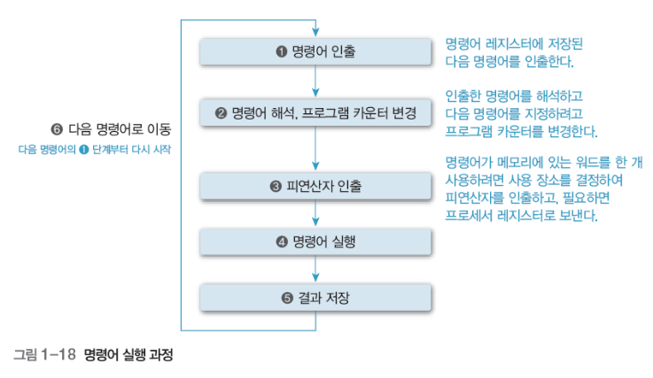

# 컴퓨터 시스템의 동작

## 1. 컴퓨터 시스템의 작업 처리 순서 

1. 입력장치로 정보를 입력받아 메모리에 저장
2. 메모리에 저장한 정보를 프로그램 제어에 따라 인출하여 연산장치에서 처리
3. 처리한 정보를 출력장치에 표시하거나 보조기억장치에 저장

## 2. 명령어의 실행

## 3. 인터럽트

: 프로세서가 프로그램을 수행하는 동안 컴퓨터 시스템의 내부나 외부에서 발생하는 예기치 못한 사건

### 폴링, Polling

- CPU가 직접 입출력장치에서 데이터를 가져오거나 내보내는 방식

- CPU가 입출력장치의 상태를 주기적으로 검사하여 일정한 조건을 만족할 때 데이터를 처리
  - CPU가 입출력까지 관여해야 하므로 작업 효율이 떨어짐

### 인터럽트, Interrupt

- 입출력 관리자가 대신 입출력을 해주는 방식, 입출력 관리자가 CPU에 보내는 완료 신호
- CPU의 작업과 저장장치의 데이터 이동을 독립적으로 운영

- 프로세서는 실행 사이클을 완료한 후 인터럽트 요구가 있는지 검사. 

  -> 인터럽트 요구가 없으면 다음 명령어를 인출하고, 인터럽트 요구가 있으면 현재 수행 중인 프로그램의 주소(프로그램 카운터) 값을 스택이나 메모리의 0번지와 같은 특정 장소에 저장. 

  -> 프로그램 카운터에는 인터럽트 처리 루틴의 시작 주소를 저장해 두었다가 인터럽트 처리를 완료하면 중단된 프로그램으로 복귀하여 계속 수행

