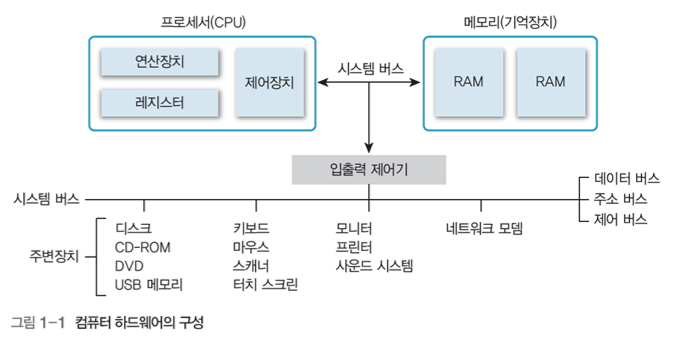
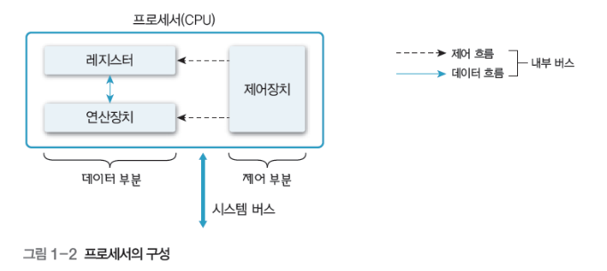
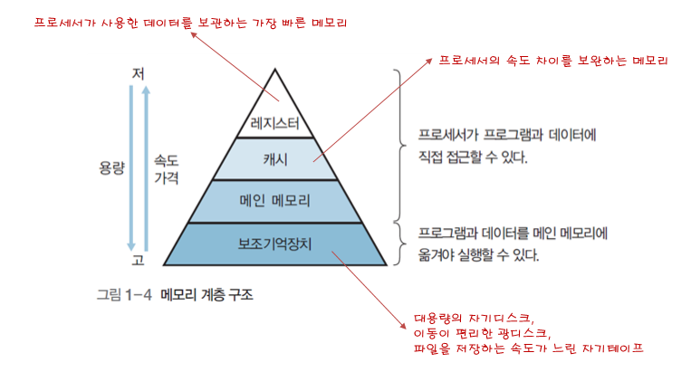
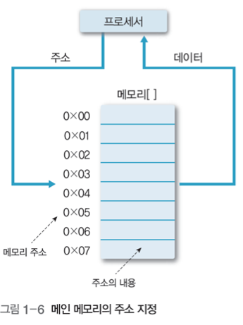

# 컴퓨터의 기본 구성

- ### 컴퓨터 시스템

  - 데이터를 처리하는 물리적인 기계장치인 하드웨어와 어떤 작업을 지시하는 명령어로 작성한 프로그램인 소프트웨어로 구성

## 1. 하드웨어의 구성

- 하드웨어는 프로세서, 메모리(기억장치), 주변장치로 구성되고, 이들은 시스템 버스로 연결
- 필수장치: 중앙처리장치, 메인메모리
  - 주변장치: 입력장치, 출력장치, 저장장치

- CPU: 명령어를 해석하여 실행하는 장치
- 메모리
  - 작업에 필요한 프로그램과 데이터를 저장하는 장소
  - 바이트 단위로 분할되어 있으며 분할 공간마다 주소로 구분

### 폰노이만 구조

- CPU, 메모리, 입출력장치, 저장장치가 버스로 연결되어 있는 구조
- 모든 프로그램은 메모리에 올라와야 실행할 수 있다.
- 메인 메모리가 유일한 작업 공간이며, 메모리 관리가 중요한 이슈임

 

## 2. 프로세서(CPU-중앙처리장치)

- 주요기능: 제어, 연산, 기억

- 제어장치 
  - 컴퓨터에 있는 모든 장치들의 동작을 지시하고 제어, 명령어를 해독해 해당하는 장치에게 제어 신호를 보내 수행
- 연산장치(ALU)
  - 제어장치의 명령을 받아 실제 연산을 수행하는 장치
  - 산술, 논리, 관계, 이동 등의 연산을 수행
- 레지스터
  - CPU내부에서 처리할 명령어나 연산의 중간 결과값 등을 일시적으로 기억하는 임시 기억장소
  - 메모리 중에서 가장 빠른 속도를 가짐

 

## 3. 메모리

#### 메모리 종류

- 휘발성 메모리
  - DRAM, Dynamic RAM : 저장된 0과 1의 데이터가 일정 시간이 지나면 사라지므로 일정 시간마다 다시 재생 시켜야 함
  - SRAM, Static RAM : 전력이 공급되는 동안에는 데이터를 보관할 수 있어 재생할 필요가 없음
  - SDRAM, Synchronous Dynamic Random Access Memory : 클록틱(펄스)이 발생할 때마다 데이터를 저장하는 동기 DRAM

- 비휘발성 메모리
  - 플래시 메모리, Flash memory
  - SSD

#### 메모리 계층 구조

- 캐시

  - 프로세서 내부나 외부에 있으며, 처리 속도가 빠른 프로세서와 상대적으로 느린 메인 메모리의 속도 차이를 보완하는 고속 버퍼
  - 메인 메모리에서 데이터를 블록 단위로 가져와 프로세서에 워드 단위로 전달하여 속도를 높임
  - 캐시의 성능은 작은 용량의 캐시에 프로세서가 이후 참조할 정보가 얼마나 들어 있느냐로 좌우됨

- 메인 메모리

  - 프로세서 외부에 있으면서 프로세서에서 수행할 프로그램과 데이터를 저장하거나 프로세서에서 처리한 결과 저장
  
  - 주기억장치 또는 1차 기억장치라고도 한다. 저장 밀도가 높고 가격이 싼 DRAM을 많이 사용
  
  - 프로세서 <-------> 메인메모리 <-------> 주변장치
    
  - 다수의 셀로 구성되며, 각 셀은 비트로 구성.
  
  - 데이터를 저장할 때, 셀 한 개나 여러 개에 나눠서 저장
  
  - 셀은 주소로 참조하는데, n비트라면 주소 범위는 0~2^(n-1)
  
    
  
  - 메모리 매핑(사상)
  
    - 컴파일로 논리적 주소를 물리적 주소로 변환하는 과정
    - 프로그래밍으로 생성된 가상 주소(논리적 주소) ---------(매핑)--------> 실제 주소(물리적 주소)
  
- 보조기억장치

  - 주변장치 중 프로그램과 데이터를 저장하는 하드웨어

 

## 4. 시스템 버스

- 하드웨어를 물리적으로 연결하여 서로 데이터를 주고 받을 수 있게 하 는 통로
- 데이터 버스
  - 데이터를 전송
  - 데이터 버스를 구성하는 배선 수==프로세서가 한번에 전송할 수 있는 비트 수==워드
- 주소 버스
  - 프로세서가 시스템의 구성 요소를 식별하는 주소 정보를 전송
  - 주소 버스를 구성하는 배선 수==프로세서와 접속할 수 있는 메인 메모리의 최대 용량
- 제어 버스
  - 프로세서가 시스템의 구성 요소를 제어하는 데 사용
