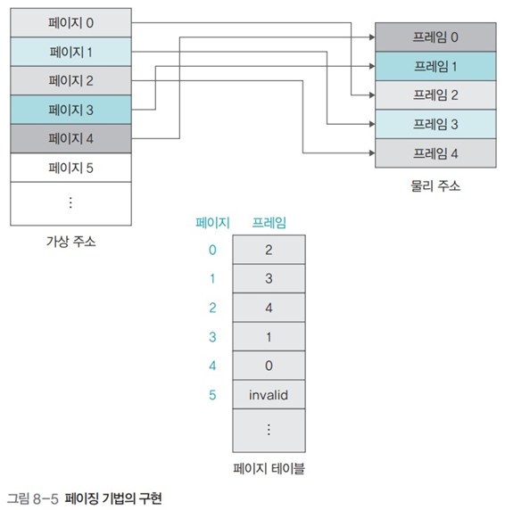

# 페이징 기법

- 고정 분할 방식을 이용한 가상 메모리 관리 기법
- 물리 주소 공간을 같은 크기로 나누어 사용

### 페이지와 프레임

- 가상 주소의 분할된 각 영역을 페이지라고 하며 번호를 매겨 관리
- 물리 메모리의 각 영역은 페이지와 구분을 위해 프레임이라고 함
- 페이지와 프레임의 크기는 같기 때문에 페이지는 어떤 프레임에도 배치될 수 있음
- 어떤 페이지가 어떤 프레임에 있는지에 대한 연결(매핑)정보는 페이지 테이블에 담겨 있음

 

### 다수의 프로세스가 있는 페이징 시스템

- 프로세스마다 페이지 테이블이 존재
- 프로세스가 많아지면 페이지 테이블의 크기가 커지고, 이에 따라 프로세스가 실제로 사용할 수 있는 메모리 영역이 줄어듬
- 페이지 테이블 크기를 적정하게 유지하는 것은 페이지 테이블 관리의 핵심

 

## 페이지 테이블 매핑 방식

### 직접 매핑

- 페이지 테이블 전체가 물리 메모리의 운영체제 영역에 존재하는 방식
- 별다른 부가 작업없이 바로 주소 변환 가능

### 연관 매핑

- 페이지 테이블 전체를 스왑 영역에서 관리하는 방식
- 물리 메모리의 여유 공간이 작을 때 사용
- 모든 페이지 테이블을 저장장치의 스왑 영역에 저장하고 그 중 일부만 물리 메모리에 가져옴
- 일부 내용만 무작위로 가져오기 때문에 페이지 번호와 프레임 번호 둘 다 표시
- 주소 변환 시 물리 메모리 내의 페이지 테이블을 다 검색해야 하며 만약 원하는 프레임 번호를 얻지 못하면 스왑 영역에 있는 페이지 테이블 검색
- 검색 실패 시 스왑 영역에서 다시 찾아야 하므로 시간을 낭비하게 됨

### 집합-연관 매핑

- 디렉토리 매핑
- 페이지 테이블을 일정한 집합으로 자르고, 자른 덩어리 단위로 물리 메모리에 가져옴
- 페이지 테이블을 n개씩 자르고 이를 관리하는 페이지 테이블을 하나 더 생성
- 새로 생성한 집합 테이블에는 일정하게 자른 페이지 테이블이 물리 메모리에 있는지, 스왑 영역에 있는지에 대한 위치 정보를 표시
- 연관 매핑과 비교했을 때 집합 테이블을 통해 원하는 페이지 테이블 엔트리가 스왑 영역에 있는지, 물리 메모리에 있는지 간단히 파악할 수 있음 
- 연관매핑과 집합 집합-연관 매핑은 캐쉬에서 사용하는 방식 임

### 역매핑

- 물리 메모리의 프레임 번호를 기준으로 테이블을 구성
- 물리 메모리의 프레임에 어떤 프로세스의 어떤 페이지가 올라와 있는지 표시
- 프로세스 수와 상관없이 테이블이 하나만 존재하므로 테이블의 크기가 매우 작음
- 프로세스가 가상 메모리에 접근할 때 프로세스 아이디와 페이지 번호를 모두 찾아야 하는 단점