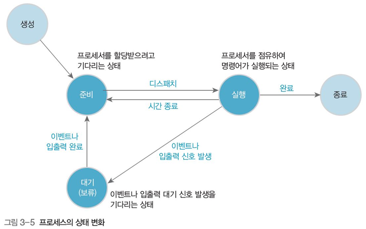

# 프로세스, Process

## 1. 프로세스의 개념

### 프로그램

: 저장장치에 저장되어 있는 정적인 상태

### 프로세스

: 실행 중인 프로그램, 실행을 위해 메모리에 올라온 동적인 상태의 프로그램

### 2. 프로세스 제어 블록(PCB, Process Control Block)

- 운영체제가 프로세스 제어 시 필요한 프로세스 상태를 저장, 관리 하는 자료 구조
  - 프로세스 구분자: 각 프로세스를 구분하는 구분자
  - 메모리 관련 정보: 프로세스의 메모리 위치 정보
  - 각종 중간값: 프로세스가 사용했던 중간 값

- 프로그램이 프로세스가 된다는 것은 운영체제로부터 프로세스 제어 블록을 얻는 다는 뜻
  - 프로세스=프로그램+프로세스 제어 블록
- 프로세스가 종료된다는 것은 해당 프로세스 제어 블록이 폐기 된다는 뜻
  - 프로그램=프로세스-프로세스 제어 블록

### 3. 프로세스의 상태 변화

|상태| 설명            | 상태변화         |
| ---- | ------------------- | ------------------ |
|생성 상태| 프로그램이 메모리에 올라오고,   운영체제로부터 프로세스 제어 블록을 할당받은 상태 | 메모리 할당, 프로세스 제어 블록 생성 |
|준비 상태|실행을 기다리는 모든 프로세스가 자기 차례를 기다리는 상태 실행될 프로세스를 CPU 스케줄러가 선택| dispatch, 준비====>실행       |
|실행 상태|CPU를 할당받아 실행 자신에게 주어진 시간을 다 사용하면, 준비(timeout) 입출력 요청 시, 대기(block)| timeout, 실행====>준비 exit, 실행====>완료 block, 실행====>대기 |
|대기 상태|입출력이 완료될때까지 기다리는 상태 입출력 완료 시, 인터럽트 발생, wakeup| wakeup, 대기====>준비 |
|완료 상태|프로세스 종료 코드와 사용했던 데이터를 메모리에서 삭제, PCB 폐기| 메모리 삭체, PCB 삭제 |
|휴식 상태|프로세스가 작업을 일시적으로 쉬고 있는 상태 종료 상태가 아니기 때문에 원할 때 다시 시작 가능|  |
|보류 상태|프로세스가 메모리에서 잠시 쫓겨난 상태| 대기====>보류대기 |
