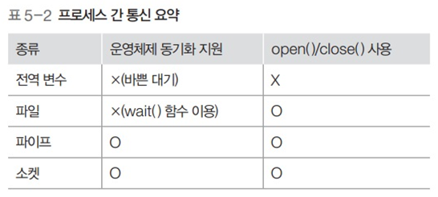

# 프로세스 간 통신

- #### 프로세스 내의 스레드 통신

  - 프로세스 내부의 스레드는 전역변수나 파일을 이용하여 데이터를 주고받음

- #### 프로세스 간 데이터 통신
  - 공용 파일 또는 운영체제가 제공하는 파이프를 사용하여 통신

- #### 네트워크를 이용한 테이터 통신
  - 소켓을 이용하여 데이터를 주고받음

 

## 공유 자원

: 여러 프로세스가 공동으로 이용하는 변수, 메모리, 파일 등을 말함

#### 경쟁 조건

- 2개 이상의 프로세스가 공유 자원을 병행적으로 읽거나 쓰는 상황

