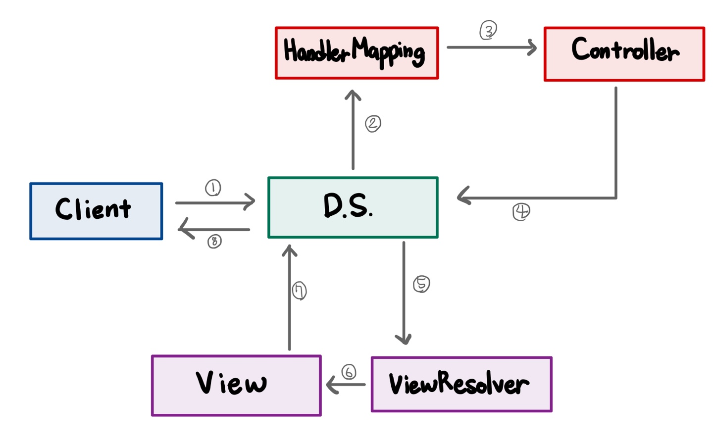

# Dispatcher Servlet, 디스패처 서블릿

- 톰갯과 같은 서블릿 컨테이너를 통해 들어오는 모든 요청을 제일 앞에서 받는 컨트롤러
- 공통된 작업을 처리한 후에 적절한 세부 컨트롤러로 작업을 위임, 그리고 각각의 세부 컨트롤러는 처리할 부분을 처리하고 반환할 view를 Dispatcher Servlet에 넘긴다.

① URL로 접근하여 정보를 요청

② 해당 요청을 매핑한 컨트롤러가 있는지 검색

③ 처리요청

④ 클라이언트의 요청을 처리하고 결과를 출력할 View의 이름을 리턴

⑤ 컨트롤러에서 보내온 View 이름을 토대로 처리 View를 검색

⑥ 처리결과를 View에 송신

⑦ 처리결과가 포함된 View를 DispatcherServlet에 송신

⑧ 최종결과 출력

