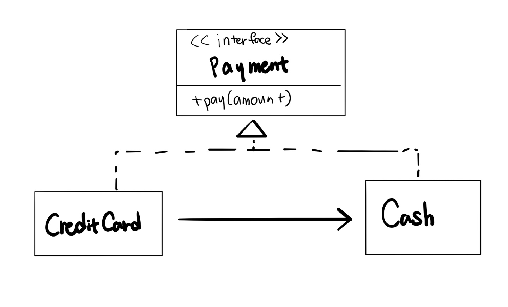

# Proxy 패턴

- proxy 패턴 구현하기



```java
//interface 생성
public interface Payment{
    void pay(int amount);
}
```

```java
//interface 사용 client쪽 코드
public class Store{
    Payment payment;
    
    //DI를 통한 의존성 주입
    public Store(Payment payment){
        this.payment = payment;
    }
    
    public void buy(int amount){
        payment.pay(amount);
    }
}
```

```java
public class Cash implements Payment{
	@Override
    public void pay(int amount){
        System.out.println(amount+" 현금결제");
    }
}
```

```java
public class CreditCard implements Payment{
    //이때, 카드가 문제가 생긴다면(한도 초과, 거래중지 등등) 현금으로 결제
    Payment cash = new Cash();
    
    @Override
    public void pay(int amount){
        if (amount > 100){
        	System.out.println(amount+" 신용카드");
    	} else {
        	cash.pay(amount);	
    	}
    }
}
```

```
public class StoreTest{
	@Test
	public void testPay(){
		Payment creditcard = new CreditCard();
		Store store = new Store(creditcard);
		
		store.buy(100);
	}
}
```

- 위 코드에서 Store는 Payment라는 interface만 가지고 있고, 판단은 CreditCard가 알아서 해주는 것
  - CreditCard==Proxy(Store와 Cash는 건들지 않은 상태에서 원하는 기능을 구현한다!)


#### Spring에서는 Bean이 등록될 때 이러한 Proxy가 생성된다. -> 개발자가 비즈니스 로직에만 집중할 수 있도록 복잡한 코드를 Spring에서 생성해 주는 것

ex) Repository의 @Transactional


참고: [예제로 배우는 스프링 입문, 10 프록시 패턴](https://www.youtube.com/watch?v=MorRFegeFqA)


